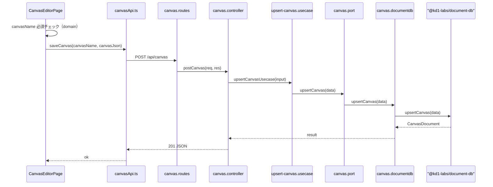

# Canvas Save to MongoDB

## 全体データフロー

## 変更ファイル一覧

### 1. サーバ: MongoDB 接続の追加

- [apps/server/src/index.ts](apps/server/src/index.ts)
  - `@kd1-labs/document-db` の `connectMongo` を import し、`app.listen` の前に `await connectMongo()` を呼ぶ
  - 既存の MySQL（db-client）接続と並列で動く形
- [apps/server/package.json](apps/server/package.json)
  - dependencies に `"@kd1-labs/document-db": "workspace:*"` を追加

### 2. サーバ: ヘキサゴナルアーキテクチャ（6ファイル新規）

既存の `users` パターンに準拠して以下を作成:

- `**ports/canvas.port.ts**` -- Canvas I/O の interface
  - `upsertCanvas(data): Promise<UpsertCanvasResult>`
- `**adapters/canvas.documentdb.ts**` -- Port の実装
  - `@kd1-labs/document-db` の `upsertCanvas` を呼び出す
  - `@kd1-labs/utils` の `generateUUIDv7` で新規 ID を生成
- `**usecases/upsert-canvas.usecase.ts**` -- ビジネスロジック
  - `makeUpsertCanvasUsecase(port)` パターン
  - canvasName の必須チェック（サーバ側でも二重チェック）
  - Express 非依存
- `**composition/canvas.composition.ts**` -- DI 組み立て
  - `makeUpsertCanvasUsecase(canvasDocumentDbAdapter)` を export
- `**controllers/canvas.controller.ts**` -- req/res 変換
  - セッションチェック（`req.session.userInfo`）
  - `req.body` から `canvasName`, `canvas` を取り出し
  - usecase 呼び出し → 201 or 400 レスポンス
  - JSDoc 必須
- `**routes/canvas.routes.ts**` -- URL 対応
  - `POST /canvas` → `postCanvas`
  - [apps/server/src/index.ts](apps/server/src/index.ts) に `app.use("/api", canvasRoutes)` を追加

### 3. クライアント: FabricCanvas に toJSON API 追加

- [apps/client/src/features/canvas/ui/FabricCanvas.tsx](apps/client/src/features/canvas/ui/FabricCanvas.tsx)
  - `FabricCanvasHandle` に `toJSON(): unknown` を追加
  - `canvasInstanceRef.current?.toJSON()` を返す

### 4. クライアント: domain にバリデーション追加

- [apps/client/src/features/canvas/domain/rules.ts](apps/client/src/features/canvas/domain/rules.ts)
  - 既存の `validateTitle` を `validateCanvasName` にリネームまたは追加
  - canvasName 必須チェック（空文字 NG）

### 5. クライアント: canvasApi に saveCanvas 追加

- [apps/client/src/features/canvas/services/canvasApi.ts](apps/client/src/features/canvas/services/canvasApi.ts)
  - `saveCanvas(canvasName: string, canvas: unknown): Promise<SaveCanvasResult>` を追加
  - `apiClient.post("/api/canvas", { canvasName, canvas })` を使用（既存の `apiClient` を活用）
  - 戻り値: `{ ok: true; id: string } | { ok: false; message: string }`

### 6. クライアント: canvas-editor.tsx の handleSave 実装

- [apps/client/src/pages/example/canvas-editor.tsx](apps/client/src/pages/example/canvas-editor.tsx)
  - Save 押下時:
    1. `validateCanvasName(canvasName)` で必須チェック → NG ならエラー表示
    2. `fabricRef.current?.toJSON()` で JSON 取得
    3. `saveCanvas(canvasName, canvasJson)` を呼び出し
    4. 成功 → 一覧へ遷移 or 成功メッセージ
    5. 失敗 → エラーメッセージ表示
  - isSaving state を追加（ボタン disabled 制御）
  - canvasNameError state を追加（バリデーションエラー表示）

## 注意事項

- `upsertCanvas` の `_id` は新規作成時にクライアントではなくサーバ側（adapter）で `generateUUIDv7()` を使って生成する
- `updatedBy` はセッションの `userInfo.userId` を使用
- `canvasDescription`, `thumbnailUrl`, `backgroundImageUrl` は今回は null で保存（後で拡張可能）

