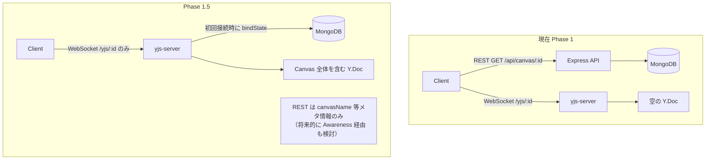

# Phase 1.5: yjs-server Persistence + Y.Doc SSOT 化

## 背景と目的

現在の問題:

- クライアントが REST API (Express) と WebSocket (yjs-server) の両方にアクセスしている
- A と B が同時接続すると、同じ Circle に異なる UUID が発行され重複が発生する
- Y.Doc が空の状態で作られ、クライアント側からデータが投入される（Y.Doc が SSOT でない）

目的: **Y.Doc を Canvas データの SSOT にする。** yjs-server が MongoDB から Canvas を読み込み Y.Doc に展開する。クライアントは Y.Doc のみからデータを復元する。

---

## アーキテクチャ変更




---

## 変更ファイル一覧

### サーバサイド (yjs-server)

- **[apps/yjs-server/package.json](apps/yjs-server/package.json)** — `@kd1-labs/document-db` を依存に追加
- **[apps/yjs-server/src/persistence.ts](apps/yjs-server/src/persistence.ts)** — 新規作成。MongoDB Persistence 実装
- **[apps/yjs-server/src/doc-manager.ts](apps/yjs-server/src/doc-manager.ts)** — `getYDoc` を async 化 + Promise ベース排他制御
- **[apps/yjs-server/src/index.ts](apps/yjs-server/src/index.ts)** — MongoDB 接続 + setPersistence 呼び出し
- **[apps/yjs-server/src/types.ts](apps/yjs-server/src/types.ts)** — 必要に応じて型追加
- **[apps/yjs-server/tsup.config.ts](apps/yjs-server/tsup.config.ts)** — external に mongoose 等を追加（バンドル除外）

### Docker / インフラ

- **[docker-compose.app.yml](docker-compose.app.yml)** — yjs-server に MONGO_* 環境変数を追加
- **[Dockerfile.yjs-server](Dockerfile.yjs-server)** — `@kd1-labs/document-db` の package.json を COPY に追加

### クライアントサイド

- **[pages/example/canvas-yjs-editor.tsx](apps/client/src/pages/example/canvas-yjs-editor.tsx)** — REST fetchCanvas を廃止、Y.Doc sync 完了で初期化
- **[features/canvas-yjs/hooks/useYjsCircleSync.ts](apps/client/src/features/canvas-yjs/hooks/useYjsCircleSync.ts)** — `syncExistingCirclesToYjs` を削除、Y.Map → Fabric のみに
- **[features/canvas-yjs/hooks/useYjsCanvasRestore.ts](apps/client/src/features/canvas-yjs/hooks/useYjsCanvasRestore.ts)** — 新規作成。Y.Doc から Fabric Canvas 全体を復元する hook

---

## 実装詳細

### Step 1: yjs-server に MongoDB 接続を追加

`@kd1-labs/document-db` パッケージを再利用する。`connectMongo()` と `findCanvasById()` が既に実装済み。

[apps/yjs-server/src/index.ts](apps/yjs-server/src/index.ts) の起動時に:

```typescript
import { connectMongo } from "@kd1-labs/document-db";

await connectMongo();
setPersistence(createMongoPersistence());
server.listen(PORT, HOST, () => { ... });
```

Docker 環境変数の追加 ([docker-compose.app.yml](docker-compose.app.yml)):

```yaml
yjs-server:
  environment:
    MONGO_HOST: ${MONGO_HOST:-mongodb}
    MONGO_PORT: ${MONGO_PORT:-27017}
    MONGO_USER: ${MONGO_USER:-kd1}
    MONGO_PASSWORD: ${MONGO_PASSWORD:-kd1}
    MONGO_DATABASE: ${MONGO_DATABASE:-kd1}
```

### Step 2: Persistence 実装 (bindState / writeState)

新規ファイル `apps/yjs-server/src/persistence.ts`:

**bindState** — MongoDB の Canvas JSON を Y.Doc に展開:

- `findCanvasById(docName)` で Canvas を取得
- Canvas JSON の `objects` 配列をオブジェクトタイプ別に Y.Map に展開
- `backgroundImage` の URL やスケール情報を Y.Map("meta") に格納
- `canvasName` 等のメタ情報も Y.Map("meta") に格納

**writeState** — Y.Doc を MongoDB に保存（全員退出時）:

- Y.Map("circles") 等から Fabric JSON 形式に逆変換
- `upsertCanvas()` で MongoDB に保存

### Step 3: getYDoc の async 化 + レースコンディション制御

[apps/yjs-server/src/doc-manager.ts](apps/yjs-server/src/doc-manager.ts) の `getYDoc` を修正:

```typescript
const docs = new Map<string, { doc: WSSharedDoc; ready: Promise<void> }>();

async function getYDoc(docName: string): Promise<WSSharedDoc> {
  const existing = docs.get(docName);
  if (existing) {
    await existing.ready;   // B は A の初期化完了を待つ
    return existing.doc;
  }

  const doc = createWSSharedDoc(docName);
  const ready = persistence !== null
    ? persistence.bindState(docName, doc)
    : Promise.resolve();

  docs.set(docName, { doc, ready });  // 同期的に Map に登録（排他制御）

  try {
    await ready;
  } catch (err) {
    docs.delete(docName);  // 失敗時は Map から削除してリトライ可能に
    doc.destroy();
    throw err;
  }

  return doc;
}
```

`setupWSConnection` も `getYDoc` が async になるため `await` を追加。SyncStep1 の送信は `await getYDoc()` の後に行われるため、MongoDB 復元完了後にのみクライアントにデータが送られる。

### Step 4: クライアント側の変更

**canvas-yjs-editor.tsx** — REST fetchCanvas を廃止:

- `fetchCanvas` + `loadFromJSON` の useEffect を削除
- `synced` を待ってから Y.Doc のデータで Fabric Canvas を初期化
- `canvasName` は Y.Map("meta") から取得

**useYjsCanvasRestore** (新規 hook) — Y.Doc → Fabric Canvas 復元:

- `synced` が true になったら Y.Map("meta") から背景画像 URL を取得し `setBackgroundImage` を呼ぶ
- Y.Map("circles") から Circle を描画（既存の `renderYjsCirclesToCanvas` を流用）
- 将来の Rect/Path 等も同様に Y.Map から復元

**useYjsCircleSync** — 簡素化:

- `syncExistingCirclesToYjs` を削除（Y.Doc が SSOT なので Fabric → Y.Map の初期投入は不要）
- `renderYjsCirclesToCanvas` と observer のみ残す

---

## Y.Doc のデータ構造設計

```
Y.Doc
├── Y.Map("meta")
│   ├── canvasName: string
│   ├── canvasDescription: string | null
│   ├── backgroundImage: { src: string, scaleX: number, scaleY: number, ... } | null
│   └── thumbnailUrl: string | null
├── Y.Map("circles")
│   ├── {uuid}: CircleProps
│   └── ...
├── Y.Map("rects")        ← Phase 2 で追加
└── Y.Map("paths")        ← Phase 2 で追加
```

### bindState での Canvas JSON → Y.Doc 変換ルール

- `canvas.objects` の各オブジェクトを `type` で分類し、対応する Y.Map に UUID をキーとして格納
- `canvas.backgroundImage` は Y.Map("meta") の `backgroundImage` に格納（URL + スケール情報）
- Phase 1.5 では Circle のみ Y.Map に展開。Rect 等は Phase 2 で追加
- Circle 以外のオブジェクトは Y.Map("fabricJson") に Fabric JSON のまま一時保存（Phase 2 まで）

---

## テスト観点

- A が Canvas-001 を開く → MongoDB から Y.Doc に展開 → Fabric に描画される
- A と B が同時に Canvas-001 を開く → Y.Doc は 1 つだけ作成される（重複なし）
- A が Circle を追加 → B にリアルタイム反映（既存の Phase 1 動作を維持）
- 全員退出 → writeState で MongoDB に保存 → 再度開くと復元される
- 背景画像が Y.Doc 経由で正しく表示される

