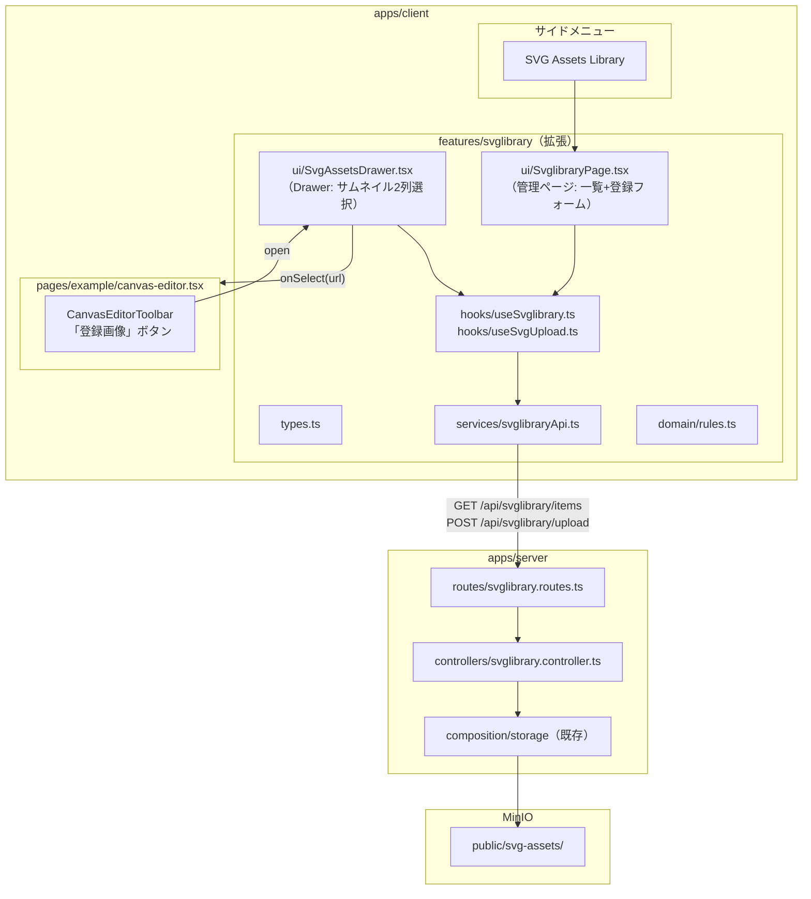

# SVG Assets Library 実装プラン

## 全体構成




---

## Phase 1: サーバー側（SVG Assets API）

### 1-1. 共有型を追加 — [packages/types/src/index.ts](packages/types/src/index.ts)

```typescript
export interface SvgAssetItem {
  key: string;       // MinIO オブジェクトキー（svg-assets/xxx.svg）
  url: string;       // 公開 URL
  title: string;     // 表示名（ファイル名 or ユーザー入力）
  createdAt: string;  // ISO string
}
```

### 1-2. StoragePort に `list` を追加 — [apps/server/src/ports/storage.port.ts](apps/server/src/ports/storage.port.ts)

現在 `upload` のみ。`list(prefix)` と `remove(key)` を追加する。

```typescript
export interface StoragePort {
  upload(key: string, body: Buffer, contentType: string): Promise<string>;
  list(prefix: string): Promise<{ key: string; lastModified: Date }[]>;
  remove(key: string): Promise<void>;
}
```

### 1-3. MinIO アダプタに `list` / `remove` 実装 — [apps/server/src/adapters/storage.minio.ts](apps/server/src/adapters/storage.minio.ts)

MinioStorageClient（`@kd1-labs/storage`）の listObjects / removeObject を使用。

### 1-4. SVG アップロード対応 — [apps/server/src/controllers/storage.controller.ts](apps/server/src/controllers/storage.controller.ts)

`CONTENT_TYPE_EXT` に `"image/svg+xml": "svg"` を追加。

### 1-5. SVG Library API ルート新規作成

- `apps/server/src/routes/svglibrary.routes.ts`
- `apps/server/src/controllers/svglibrary.controller.ts`


| メソッド | パス                   | 機能                                                       |
| -------- | ---------------------- | ---------------------------------------------------------- |
| GET      | /api/svglibrary/items  | svg-assets/ プレフィックスの一覧を返す                     |
| POST     | /api/svglibrary/upload | SVGソース（テキスト）を受け取り svg-assets/ にアップロード |
| DELETE   | /api/svglibrary/:key   | 指定キーを削除（将来用、今回は任意）                       |


### 1-6. サーバーエントリにルート登録 — [apps/server/src/index.ts](apps/server/src/index.ts)

`app.use("/api", svglibraryRoutes);` を追加。

---

## Phase 2: クライアント — SVG Assets Drawer（キャンバス用）

### 2-1. types.ts を拡張 — [apps/client/src/features/svglibrary/types.ts](apps/client/src/features/svglibrary/types.ts)

`SvgAssetItem` を `@kd1-labs/types` から import し、feature 内で再 export。
`SvglibraryItem` は `SvgAssetItem` に置換。

### 2-2. services/svglibraryApi.ts を拡張

- `fetchSvgAssets()`: GET /api/svglibrary/items（既存の `fetchSvglibraryItems` を改修）
- `uploadSvgAsset(title, svgSource)`: POST /api/svglibrary/upload（新規追加）
- `apiClient`（axios）に切り替え（既存は素の fetch を使用 → 他 feature と統一）

### 2-3. hooks を追加/改修

- `useSvgAssets()`: 一覧取得（既存 `useSvglibrary` を改修）
- `useSvgUpload()`: アップロードフォーム用の状態管理（新規）

### 2-4. SvgAssetsDrawer.tsx を新規作成 — `features/svglibrary/ui/`

既存の `[components/drawer.tsx](apps/client/src/components/drawer.tsx)` を使用:

- `Drawer` + `DrawerHeader`（title="SVG Assets Library"）+ `DrawerBody`
- `size="sm"` で小さめの幅
- 2列グリッド（`grid grid-cols-2 gap-3`）でサムネイル表示
- 各サムネイルはクリックで `onSelect(svgUrl)` コールバック
- ローディング/空状態/エラーの表示

```
+----------------------------+
| SVG Assets Library      [x]|
+----------------------------+
| [SVG 1]  [SVG 2]          |
| [SVG 3]  [SVG 4]          |
| [SVG 5]  [SVG 6]          |
|  ...                       |
+----------------------------+
```

### 2-5. canvas-editor.tsx を改修 — [pages/example/canvas-editor.tsx](apps/client/src/pages/example/canvas-editor.tsx)

- `handleToolChange` で `tool === "image"` のとき Drawer を開く
- Drawer の `onSelect(url)` で SVG を Fabric.js キャンバスに配置
- `FabricCanvas` に SVG 配置メソッドを追加（`addSvgFromUrl` 等）

---

## Phase 3: クライアント — SVG Assets 管理ページ

### 3-1. SvglibraryPage.tsx を改修（管理ページ化）

既存のスタブページを本格実装:

- **一覧エリア**: グリッドでSVGサムネイル表示（削除ボタン付き）
- **登録フォーム**:
  - TextArea で SVG ソースコードを貼り付け
  - タイトル入力（Input）
  - Preview トグル（SVG を `dangerouslySetInnerHTML` またはオブジェクトURLでプレビュー）
  - Save ボタン → `useSvgUpload` → API → 一覧更新

### 3-2. App.tsx にルート追加 — [apps/client/src/App.tsx](apps/client/src/App.tsx)

```typescript
<Route path="/svg-assets" element={<SvglibraryPage />} />
```

### 3-3. dashboard-layout.tsx にメニュー追加 — [apps/client/src/layouts/dashboard-layout.tsx](apps/client/src/layouts/dashboard-layout.tsx)

Example セクションに「SVG Assets Library」メニュー項目を追加。

---

## 影響範囲まとめ


| レイヤー                      | ファイル                               | 変更内容                 |
| ----------------------------- | -------------------------------------- | ------------------------ |
| packages/types                | `src/index.ts`                         | `SvgAssetItem` 型追加    |
| server                        | `ports/storage.port.ts`                | `list`, `remove` 追加    |
| server                        | `adapters/storage.minio.ts`            | `list`, `remove` 実装    |
| server                        | `controllers/storage.controller.ts`    | SVG の Content-Type 追加 |
| server                        | `routes/svglibrary.routes.ts`          | 新規                     |
| server                        | `controllers/svglibrary.controller.ts` | 新規                     |
| server                        | `index.ts`                             | ルート登録               |
| client/features/svglibrary    | types, services, hooks, ui             | 全面改修                 |
| client/features/svglibrary/ui | `SvgAssetsDrawer.tsx`                  | 新規                     |
| client/features/canvas/ui     | `FabricCanvas.tsx`                     | SVG 配置メソッド追加     |
| client/pages                  | `canvas-editor.tsx`                    | Drawer 連携              |
| client                        | `App.tsx`                              | ルート追加               |
| client/layouts                | `dashboard-layout.tsx`                 | メニュー追加             |


## 設計方針の確認

- **Catalyst First**: Drawer は既存 `components/drawer.tsx` を使用
- **関心の分離**: UI(Drawer/Page) は Presentational、I/O は services、状態は hooks
- **SSOT**: `SvgAssetItem` は `packages/types` に定義
- **依存方向**: canvas-editor(page) → svglibrary(feature) → components は OK
- SVG のサニタイズはサーバー側で検討（XSS 対策として DOMPurify 等、Phase 3 で判断）

