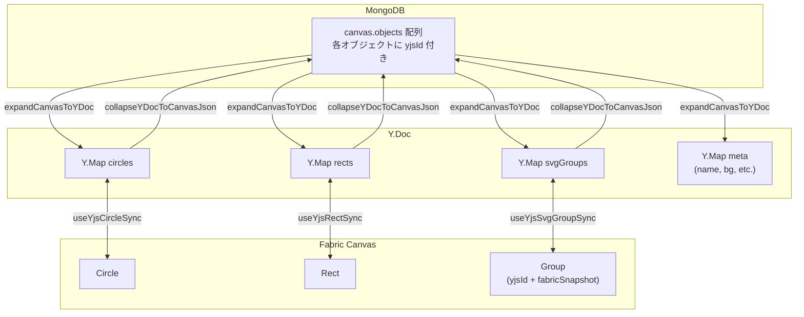

# SVG Group 共同編集 B案実装プラン

## 前提

- **B案**: `Group.toObject()` の完全 JSON（fabricSnapshot）を Y.Map に丸ごと保持し同期する
- **nonCircleObjects 廃止**: Circle / Rect / Group の3種全てが専用 Y.Map で管理される。`else` 分岐は不要
- **既存キャンバス削除前提**: `yjsId` なしの既存データのマイグレーションは不要
- **POC目的**: メモリリーク等のメトリクス取得が主目的

## 全体データフロー




## 変更ファイル一覧


| #   | ファイル                                                                | 変更内容                                                             |
| --- | ----------------------------------------------------------------------- | -------------------------------------------------------------------- |
| 1   | `apps/client/src/features/canvas/fabricRegisterGroupSvgMetadata.ts`     | `yjsId` を stateProperties に追加                                    |
| 2   | `apps/client/src/features/canvas-yjs/domain/svgPlacementYjs.ts`         | B案用の `SvgGroupYjsProps` に書き換え（fabricSnapshot 中心）         |
| 3   | `apps/client/src/features/canvas-yjs/hooks/useYjsSvgPlacementSync.ts`   | B案用の `useYjsSvgGroupSync` に書き換え                              |
| 4   | `apps/client/src/features/canvas-yjs/services/loadSvgGroupForCollab.ts` | 不要になるため削除                                                   |
| 5   | `apps/client/src/pages/example/canvas-editor.tsx`                       | `handleSvgSelect` で `meta.key` を渡す                               |
| 6   | `apps/client/src/pages/example/canvas-yjs-editor.tsx`                   | `handleSvgSelect` で `meta.key` を渡す + `useYjsSvgGroupSync` 有効化 |
| 7   | `apps/yjs-server/src/kd1/persistence.ts`                                | Group の expand/collapse 対応 + `nonCircleObjects` 廃止              |


---

## Step 1: `yjsId` を Group の stateProperties に追加

**ファイル**: [fabricRegisterGroupSvgMetadata.ts](apps/client/src/features/canvas/fabricRegisterGroupSvgMetadata.ts)

現在 `["svgAssetKey", "svgAssetUrl"]` のみ。ここに `"yjsId"` を追加する。

```typescript
const KEYS = ["svgAssetKey", "svgAssetUrl", "yjsId"] as const;
```

これにより `Group.toObject()` / `canvas.toJSON()` で `yjsId` が自動的に JSON に含まれ、`loadFromJSON` で復元される。通常エディタでの保存 → MongoDB → Y.doc 展開のサイクルで ID が保持される。

---

## Step 2: domain 型定義を B案用に変更

**ファイル**: [svgPlacementYjs.ts](apps/client/src/features/canvas-yjs/domain/svgPlacementYjs.ts) (リネーム推奨: `svgGroupYjs.ts`)

A案の `SvgPlacementYjsProps`（変形プロパティ + fabricSnapshot）を、B案では **fabricSnapshot が主体** の型に変更する。

```typescript
export interface SvgGroupYjsProps {
  fabricSnapshot: Record<string, unknown>;
}
```

B案では fabricSnapshot に Group.toObject() の完全 JSON が入り、変形プロパティ（left, top, scale 等）も fabricSnapshot 内に含まれるため、トップレベルに重複して持つ必要がない。

`SVG_PLACEMENT_TRANSFORM_KEYS` も不要になるため削除。

---

## Step 3: `useYjsSvgGroupSync` hook の書き換え

**ファイル**: [useYjsSvgPlacementSync.ts](apps/client/src/features/canvas-yjs/hooks/useYjsSvgPlacementSync.ts) (リネーム推奨: `useYjsSvgGroupSync.ts`)

Circle/Rect の同期パターンに合わせて書き換える。主な変更点:

**(a) Group の判定**: `obj.type === "group"` で判定（`svgAssetKey` の有無ではなく type ベース）

**(b) Fabric -> Y.Map**: `Group.toObject()` の完全 JSON を `fabricSnapshot` として保存

```typescript
function fabricToYjs(obj: Group): SvgGroupYjsProps {
  const snapshot = obj.toObject() as Record<string, unknown>;
  return { fabricSnapshot: snapshot };
}
```

**(c) Y.Map -> Fabric (復元)**: `fabricSnapshot` から `canvas.loadFromJSON` 相当で Group を再構築。Fabric.js の `util.enlivenObjects` を使用して fabricSnapshot から Group を復元する。

```typescript
import { util } from "fabric";

async function snapshotToGroup(
  snapshot: Record<string, unknown>,
): Promise<Group | null> {
  const objects = await util.enlivenObjects([snapshot]);
  const group = objects[0];
  return group instanceof Group ? group : null;
}
```

**(d) observer**: add/update/delete の3パターン。update 時は既存 Group を remove して新しい Group を add する（fabricSnapshot 丸ごと差し替え）。

**(e) `loadSvgGroupUnscaled` / `loadSvgGroupForCollab.ts`**: B案では SVG URL からの読み込みが不要になるため、この service は削除する。

---

## Step 4: 通常エディタで `yjsId` + `svgAssetKey` を付与

**ファイル**: [canvas-editor.tsx](apps/client/src/pages/example/canvas-editor.tsx)

```typescript
const handleSvgSelect = useCallback((item: SvgAssetItem) => {
  setSvgDrawerOpen(false);
  fabricRef.current?.placeSvgFromUrl(item.url, { key: item.key });
}, []);
```

`FabricCanvas.tsx` の `placeSvgFromUrl` は既に `meta.key` を受け取って `svgAssetKey` / `svgAssetUrl` を Group に set する実装がある。加えて、配置時に `yjsId` も付与する必要がある。

**ファイル**: [FabricCanvas.tsx](apps/client/src/features/canvas/ui/FabricCanvas.tsx) L211 付近

```typescript
group.set({ left: x, top: y });
if (placementKey) {
  group.set({
    svgAssetKey: placementKey,
    svgAssetUrl: urlToPlace,
    yjsId: crypto.randomUUID(),  // 追加
  });
}
```

---

## Step 5: Yjs エディタで hook 有効化

**ファイル**: [canvas-yjs-editor.tsx](apps/client/src/pages/example/canvas-yjs-editor.tsx)

```typescript
// import 追加
import { useYjsSvgGroupSync } from "@/features/canvas-yjs/hooks/useYjsSvgGroupSync";

// hook 呼び出し（L43-45 付近）
useYjsCircleSync(yDoc, fabricRef, isRestored, collabRemoteApplyDepthRef);
useYjsRectSync(yDoc, fabricRef, isRestored, collabRemoteApplyDepthRef);
useYjsSvgGroupSync(yDoc, fabricRef, isRestored, collabRemoteApplyDepthRef);  // 追加

// handleSvgSelect で meta.key を渡す
const handleSvgSelect = useCallback((item: SvgAssetItem) => {
  setSvgDrawerOpen(false);
  fabricRef.current?.placeSvgFromUrl(item.url, { key: item.key });
}, []);
```

---

## Step 6: サーバ persistence の変更

**ファイル**: [persistence.ts](apps/yjs-server/src/kd1/persistence.ts)

### 6a. `expandCanvasToYDoc` の変更

- `nonCircleObjects` 配列を**廃止**
- `type === "Group"` の分岐を追加し、`yDoc.getMap("svgGroups")` に展開
- Group の fabricSnapshot は **オブジェクト JSON そのもの**

```typescript
const yCircles = yDoc.getMap<CircleProps>("circles");
const yRects = yDoc.getMap<RectYjsProps>("rects");
const ySvgGroups = yDoc.getMap<SvgGroupYjsProps>("svgGroups");

for (const obj of fabricJson.objects) {
  const id = typeof obj.yjsId === "string" ? obj.yjsId : crypto.randomUUID();

  if (isCircleType(String(obj.type))) {
    yCircles.set(id, { /* ... */ });
  } else if (isRectType(String(obj.type))) {
    yRects.set(id, { /* ... */ });
  } else if (isGroupType(String(obj.type))) {
    ySvgGroups.set(id, { fabricSnapshot: obj });
  }
  // else 分岐なし（nonCircleObjects 廃止）
}
```

### 6b. `collapseYDocToCanvasJson` の変更

- `svgGroups` Y.Map を走査して `fabricSnapshot` を objects に追加
- `nonCircleObjects` の読み出しを**削除**

```typescript
const ySvgGroups = yDoc.getMap<SvgGroupYjsProps>("svgGroups");
ySvgGroups.forEach((props, id) => {
  const obj = props.fabricSnapshot as FabricObjectJson;
  obj.yjsId = id;
  objects.push(obj);
});

// nonCircleObjects の処理を削除
```

---

## Step 7: 不要ファイルの削除

- [loadSvgGroupForCollab.ts](apps/client/src/features/canvas-yjs/services/loadSvgGroupForCollab.ts) - B案では SVG URL 読み込みが不要
- `services/index.ts` の export から削除

---

## 動作確認手順

1. MongoDB の既存キャンバスを削除
2. 通常エディタで新規キャンバスを作成し、Circle + Rect + SVG Group を配置して保存
3. MongoDB で `yjsId` が Circle / Rect / Group 全てに付与されていることを確認
4. Yjs エディタで開き、Group が正しく表示されることを確認
5. 2つのブラウザで同時接続し、Group の移動・拡大縮小・削除が同期されることを確認
6. 全員退出後、MongoDB に正しく保存されていることを確認
7. 再度 Yjs エディタで開き、Group が正しく復元されることを確認

