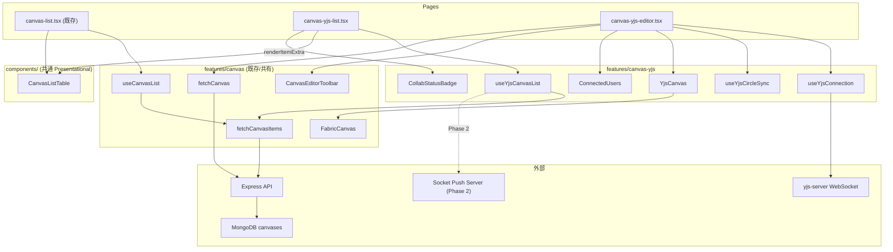

# Yjs Collab Canvas アーキテクチャ設計

## 方針: ページ・feature ともに分離、共通部品は再利用

既存の Canvas App (`features/canvas/`) と Yjs Canvas (`features/canvas-yjs/`) はページ・feature を**別管理**とする。
理由: 振る舞い差異（新規作成なし、ステータス表示、Socket 接続）が大きく、条件分岐で吸収すると OCP 違反になるため。

---

## 1. ディレクトリ構成

```
apps/client/src/
├── components/
│   └── canvas-list-table.tsx      # 新規: 共通一覧コンポーネント（検索・ソート・カード表示）
│
├── features/
│   ├── canvas/                    # 既存: 単独編集用（変更なし）
│   │   ├── domain/
│   │   ├── hooks/
│   │   ├── services/
│   │   ├── ui/
│   │   └── types.ts
│   │
│   └── canvas-yjs/                # 新規: Yjs 共同編集用
│       ├── domain/
│       │   └── rules.ts           # Yjs 固有のドメインロジック（ステータス判定等）
│       ├── hooks/
│       │   ├── useYjsCanvasList.ts  # 一覧取得 + Socket ステータス合成
│       │   ├── useYjsConnection.ts  # WebsocketProvider 接続・Awareness
│       │   └── useYjsCircleSync.ts  # Fabric <-> Y.Map バインディング
│       ├── services/
│       │   └── canvasYjsApi.ts    # Yjs 固有の API（あれば）
│       ├── ui/
│       │   ├── YjsCanvas.tsx      # Fabric Canvas + Yjs 統合
│       │   ├── ConnectedUsers.tsx  # Awareness アバター一覧
│       │   └── CollabStatusBadge.tsx # "ready" / "editing (3)" 表示
│       ├── types.ts               # CollabStatus, AwarenessState 等
│       └── index.ts
│
├── pages/example/
│   ├── canvas-list.tsx            # 既存（リファクタ: CanvasListTable を利用）
│   ├── canvas-editor.tsx          # 既存（変更なし）
│   ├── canvas-yjs-list.tsx        # 新規: Yjs 一覧ページ
│   └── canvas-yjs-editor.tsx      # 新規: Yjs 共同編集ページ
```

## 2. 一覧ページの差異整理


| 項目        | Canvas App (`canvas-list.tsx`) | Yjs Canvas (`canvas-yjs-list.tsx`)       |
| --------- | ------------------------------ | ---------------------------------------- |
| データ取得     | `useCanvasList` (REST のみ)      | `useYjsCanvasList` (REST + Socket ステータス) |
| 新規作成ボタン   | あり (`/example/canvas/new`)     | **なし**                                   |
| 遷移先       | `/example/canvas/:id`          | `/example/canvas-yjs/:id`                |
| ステータス表示   | なし                             | **あり** (ready/None, 編集中人数)               |
| 検索・ソート    | あり                             | あり（ロジック共通）                               |
| サムネカード UI | あり                             | あり（UI 共通、ステータスバッジ追加）                     |


## 3. 共通化する部分

### 3.1 CanvasListTable (`components/canvas-list-table.tsx`)

既存 `canvas-list.tsx` から検索・ソート・カード一覧の UI を切り出した Presentational コンポーネント。

```typescript
// components/canvas-list-table.tsx
import type { CanvasListItem } from '@kd1-labs/types'
import type { ReactNode } from 'react'

type SortKey = 'canvasName' | 'updatedAt' | 'updaterName'

type Props = {
  items: CanvasListItem[];
  isLoading: boolean;
  errorMessage?: string;
  /** カード遷移先を生成（canvas vs canvas-yjs で異なる） */
  getItemHref: (item: CanvasListItem) => string;
  /** 各カードの右側等に差し込む拡張スロット（ステータスバッジ等） */
  renderItemExtra?: (item: CanvasListItem) => ReactNode;
  /** ヘッダー右のアクション領域（新規作成ボタン等） */
  headerAction?: ReactNode;
}
```

**含まれるもの:**

- 検索バー（`InputGroup` + `MagnifyingGlassIcon`）
- ソートセレクト（`Select`）
- カード一覧（サムネイル + 名前 + 更新日 + 更新者アバター）
- ローディング / エラー / 空表示

**含まれないもの（呼び出し元の責務）:**

- ページ見出し（`Heading` / `Text`）
- データ取得（hooks 経由）
- `headerAction` の中身（Canvas App は Create ボタン、Yjs は何もなし）
- `renderItemExtra` の中身（Yjs は CollabStatusBadge）

### 3.2 features/canvas から再利用するもの

- `**fetchCanvasItems()`** — [apps/client/src/features/canvas/services/canvasApi.ts](apps/client/src/features/canvas/services/canvasApi.ts)
- `**fetchCanvas()`** — 同上
- `**sortByUpdatedAtDesc()`** — [apps/client/src/features/canvas/domain/rules.ts](apps/client/src/features/canvas/domain/rules.ts)
- `**CanvasListItem` 型** — [packages/types/src/index.ts](packages/types/src/index.ts)
- `**FabricCanvas` / `CanvasEditorToolbar`** — エディタページで再利用

## 4. 一覧ページ hooks の設計

```typescript
// features/canvas-yjs/hooks/useYjsCanvasList.ts

type CollabStatus = 'ready' | 'none';

type YjsCanvasListItem = CanvasListItem & {
  collabStatus: CollabStatus;
  activeEditors: number;
};

// Phase 1: REST のみ（Socket なし）
// Phase 2: Socket でステータスをリアルタイム更新
function useYjsCanvasList(): {
  items: YjsCanvasListItem[];
  isLoading: boolean;
  errorMessage?: string;
}
```

Phase 1 では `fetchCanvasItems()` を呼び、`collabStatus: 'none'`, `activeEditors: 0` を付与。
Phase 2 で Socket 経由のステータス Push を `useEffect` で購読し、`items` をリアルタイム更新。

## 5. ルーティング

[apps/client/src/App.tsx](apps/client/src/App.tsx) に追加:

```typescript
<Route path="/example/canvas-yjs" element={<CanvasYjsListPage />} />
<Route path="/example/canvas-yjs/:id" element={<CanvasYjsEditorPage />} />
```

現在の `<ComingSoonPage />` を `<CanvasYjsListPage />` に置き換える。

## 6. データフロー図




## 7. 実装フェーズ

- **Phase 1a-1**: CanvasListTable 切り出し — `canvas-list.tsx` から `components/canvas-list-table.tsx` を抽出、既存ページをリファクタ（振る舞い変更なし） **--- 完了 (2026-03-09)**
- **Phase 1a-2**: Yjs 一覧ページ — `canvas-yjs-list.tsx` + `useYjsCanvasList` + `CollabStatusBadge`（REST のみ、ステータスは placeholder） **--- 完了 (2026-03-09)**
- **Phase 1b**: エディタページ — `canvas-yjs-editor.tsx` + `useYjsConnection` + `useYjsCircleSync`（Yjs 共同編集の本体） **--- 未着手**
- **Phase 2**: Socket ステータス Push — 一覧ページにリアルタイムステータスを統合 **--- 未着手**

---

## 8. 進捗ログ (2026-03-09)

### 完了した作業

1. `components/canvas-list-table.tsx` を新規作成 — 検索・ソート・カード一覧の共通 Presentational コンポーネント
  - props: `getItemHref`, `renderItemExtra`, `headerAction` でページごとの差異を注入（OCP 準拠）
2. `pages/example/canvas-list.tsx` をリファクタ — CanvasListTable を使う形に簡素化（振る舞い変更なし）
3. `features/canvas-yjs/` を _template パターンに準拠して構築
  - `types.ts`: CollabStatus, YjsCanvasListItem, YjsCanvasListViewModel
  - `domain/rules.ts`: collabStatusLabel() 純関数
  - `hooks/useYjsCanvasList.ts`: REST API 経由の一覧取得（Phase 1: ステータスは placeholder）
  - `ui/CollabStatusBadge.tsx`: Catalyst Badge を使ったステータスバッジ
4. `pages/example/canvas-yjs-list.tsx` を新規作成 — 新規作成ボタンなし、ステータスバッジ付き
5. `App.tsx` ルーティング更新 — `/example/canvas-yjs` を CanvasYjsListPage に、`:id` ルートを ComingSoonPage に
6. TypeScript 型チェック通過確認済み

### 次回やること (Phase 1b)

- `pages/example/canvas-yjs-editor.tsx` — Yjs 共同編集エディタページ
- `hooks/useYjsConnection.ts` — WebsocketProvider 接続・Awareness 管理
- `hooks/useYjsCircleSync.ts` — Fabric.js <-> Y.Map バインディング
- `ui/YjsCanvas.tsx` — FabricCanvas + Yjs 統合コンポーネント
- `ui/ConnectedUsers.tsx` — Awareness アバター一覧
- クライアント依存追加: `yjs`, `y-websocket`
- 参照: `docs/yjs/implementation-plan.md`, `docs/yjs/architecture.md`

