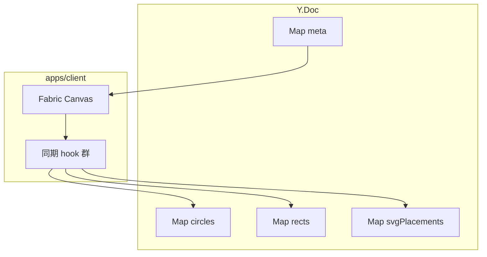

# Yjs 共同編集 最終実装プラン（Rect / 登録画像 A 案 / 削除）

## ゴール（合意）

| 対象             | 方針                                                                                                                       |
| ---------------- | -------------------------------------------------------------------------------------------------------------------------- |
| Circle           | **現状維持** — `[useYjsCircleSync.ts](apps/client/src/features/canvas-yjs/hooks/useYjsCircleSync.ts)` + `Y.Map("circles")` |
| Rect             | **Y.Doc（CRDT）** — 新規 `Y.Map("rects")`、標準プロパティをホワイトリスト同期                                              |
| 登録画像         | **A 案** — `SvgAssetItem.key`（+ 必要なら `url`）+ Group の標準トランスフォームを CRDT 化                                  |
| オブジェクト削除 | **CRDT** — 各オブジェクトが Map に載っている限り `object:removed` → `yMap.delete(id)`（既存 Circle と同じパターンの拡張）  |

## アーキテクチャ方針

- **Circle 用 Map 名は変えない**（既存ドキュメント・永続データ・接続中クライアントとの互換を簡単にするため）。
- Rect / SVG は **別 Map** に分離（型ごとに `fabricToYjs` / 復元ロジックが違うため。単一 Map に統合するのは後続リファクタでも可）。
- **リモート更新ループ防止**は Circle 同様 `isRemoteRef` を **同期処理全体で共有**する（複数 hook に分ける場合は親の `useYjsFabricCollab` で 1 つの ref を渡すか、1 hook 内でまとめる）。

## 1. 型とドメイン（`features/canvas-yjs`）

- **配置**: 純粋関数は `[apps/client/src/features/canvas-yjs/domain/](apps/client/src/features/canvas-yjs/domain/)`（新規ファイル例: `rectYjs.ts`, `svgPlacementYjs.ts`）に切り出し。React / Fabric の import は **変換境界だけ**に閉じるか、Fabric 型は引数の最小限に留める（AGENTS.md の domain 方針に沿うなら「プレーン型 ↔ 座標オブジェクト」の境界を明確化）。
- **Rect**: `RectYjsProps` を定義し、実際に編集で使う標準プロパティを **明示リスト**（例: `left`, `top`, `width`, `height`, `fill`, `stroke`, `strokeWidth`, `scaleX`, `scaleY`, `angle`, `skewX`, `skewY`, `opacity`, `flipX`, `flipY`, `visible` — 最終リストは `[FabricCanvas` の Rect 生成](apps/client/src/features/canvas/ui/FabricCanvas.tsx)とユーザー操作範囲で確定）。
- **SVG（A 案）**: `SvgPlacementYjsProps` — 最低限 `svgAssetKey: string`、任意 `svgAssetUrl: string | null`、あとは Group として同期するトランスフォーム群（Circle/Rect と同様のホワイトリスト）。
- **ID**: 既存と同様 `yjsId` / WeakMap またはオブジェクト生成時の UUID。リモートから来たキーは Map の key と Fabric 側の対応表に固定。

## 2. クライアント hook

- **新規** `[useYjsRectSync](apps/client/src/features/canvas-yjs/hooks/useYjsRectSync.ts)`: Circle と対称。`obj.type === 'rect'` のみ `Y.Map("rects")` と双方向バインド。初期 `renderYjsRectsToCanvas` で bindState 後の復元。
- **新規** `[useYjsSvgPlacementSync](apps/client/src/features/canvas-yjs/hooks/useYjsSvgPlacementSync.ts)`（名称可変）:
  - **ローカル**: 配置完了後の Group に **識別用カスタムプロパティ**を付与（例: `data.svgAssetKey` または Fabric の `set` でシリアライズされるフィールド — `toObject` に載ることを確認）。**グループかつ key あり**のものだけ Y に載せる。
  - **リモート add/update**: `loadSVGFromURL` + `groupSVGElements` で **非同期再構築**。進行中はプレースホルダ（単色 Rect / スピナー用の不可視マーカー）か、既存オブジェクトを一時的に `opacity:0` 等 — **UX は最小実装で可**（失敗時は `console.warn` + トーストは任意）。
  - **リモート delete**: Map delete → `canvas.remove`（Circle と同様）。
- **統合**: `[canvas-yjs-editor.tsx](apps/client/src/pages/example/canvas-yjs-editor.tsx)` で `isRestored` 後に `useYjsCircleSync` に加え Rect / SVG の hook を呼ぶ。**実行順序**は同一 `useEffect` 依存（`yDoc`, `fabricRef`, `isRestored`）で問題ないが、`isRemoteRef` は共有必須。
- **エクスポート**: `[hooks/index.ts](apps/client/src/features/canvas-yjs/hooks/index.ts)` を更新。

## 3. FabricCanvas / 配置フローの変更（最小）

- `[FabricCanvas.tsx](apps/client/src/features/canvas/ui/FabricCanvas.tsx)` の `placeSvgFromUrl` / 配置完了時に、`**SvgAssetItem.key` を Group に書き込む**ための引数追加（例: `placeSvgFromUrl(url: string, meta?: { key: string })`）。呼び出し元 `[canvas-yjs-editor.tsx](apps/client/src/pages/example/canvas-yjs-editor.tsx)` の `handleSvgSelect` で `item.key` を渡す。
- Yjs ページ以外（通常 canvas-editor）は `meta` 省略で従来どおり（後方互換）。

## 4. サーバ永続化 `[apps/yjs-server/src/kd1/persistence.ts](apps/yjs-server/src/kd1/persistence.ts)`

- `**expandCanvasToYDoc`**: Mongo の Fabric JSON `objects` を走査し、`type` が `rect`/`Rect` → `yDoc.getMap("rects")`、Circle → 既存 `circles`、**SVG 配置**は `yjsId` + 保存されている `svgAssetKey`（または従来 `nonCircleObjects` 内の慣例）で `svgPlacements` に投入。判定できないオブジェクトのみ従来どおり `meta.nonCircleObjects` に逃がす（**段階的に縮小**）。
- `**collapseYDocToCanvasJson`**: `rects` / `svgPlacements` を `objects` 配列にマージ（`yjsId` 付与）。Circle 既存ロジックの直後に追加。最終的な `objects` の順序ルール（z-index）を **定義**（例: circles → rects → svg の固定順は避け、単一の `zIndex` を Y に持たない限り **Map 反復順に依存しない**よう、可能なら `order` フィールドを将来検討 — **初版は既存 Circle と同様の単純マージで可**と明記）。
- クライアントの Fabric 7 と JSON の `type` 文字列（`circle` vs `Circle`）は既存 `[isCircleType](apps/yjs-server/src/kd1/persistence.ts)` と同様に **両対応**。

## 5. ドキュメント

- `[docs/yjs/implementation-plan.md](docs/yjs/implementation-plan.md)` に Phase 1.6 相当として Rect / SVG / 削除の項目を追記。
- 公開 MD があれば `[apps/client/public/md/yjs-architecture.md](apps/client/public/md/yjs-architecture.md)` を軽く更新。

## 6. 検証手順（受け入れ基準）

1. 同一 canvasId で 2 タブ: **Rect** 追加・移動・変形・削除が双方向に一致。
2. **登録画像** 配置後、もう一方のタブで同一 Group が **非同期読み込み後**に表示され、移動・削除が同期。
3. サーバ全員退出後に Mongo 再読込（bindState）で Rect / SVG が **復元**される。
4. 既存 **Circle のみ**のキャンバスが従来どおり動作（回帰）。

## 7. 実装順序（推奨）

1. **Rect**（同期のみ・永続化 expand/collapse 追加）— リスク低く A 案 SVG の土台（共有 `isRemoteRef` パターン）を確認。
2. **SVG A 案**（Fabric に key 付与 → hook → persistence の型判別）。
3. **結合テスト**とドキュメント更新。

## 8. スコープ外（明示）

- テキストツール・その他 Fabric 型の CRDT 化。
- `nonCircleObjects` の完全削除（初版はフォールバック維持）。
- SVG の `toObject` フルスナップショット（B 案）。

## リスク・注意

- **SVG 非同期**: リモート add 中にローカルが同じオブジェクトを触る競合は、初版は Y の最終状態で上書き同期に寄せる（**細かい OT は不要**という前提）。
- **Z 順**: Map 複数に分かれるとレイヤ順が Mongo との往復で変わる可能性 — 初版は受け入れテストで確認し、問題あれば `order` または単一 `objects` Map への移行を別タスク化。

