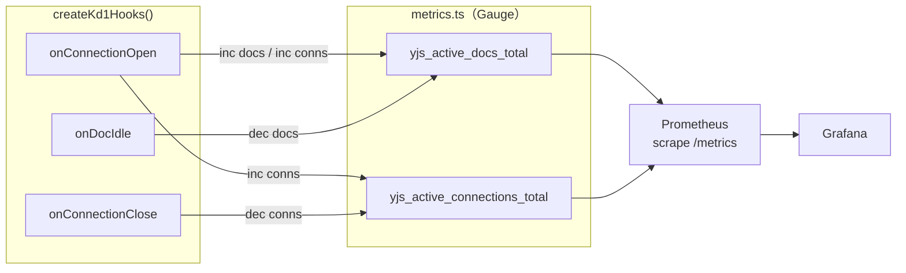

# yjs-server カスタムメトリクス追加（フェーズ2）

## 方針

prom-client の `Gauge`（増減する値）を使い、既存の `createKd1Hooks()` 内のフックからメトリクス値を更新する。新しい依存やコンテナは不要。

## データフロー




## 既存フックとの対応

既に `[apps/yjs-server/src/kd1/hooks.ts](apps/yjs-server/src/kd1/hooks.ts)` に以下のフックが実装済み：

- `onConnectionOpen` -- 接続確立時（`doc.conns.size` が取得可能）
- `onConnectionClose` -- 接続切断時（`doc.conns.size` が取得可能）
- `onDocIdle` -- 全員離脱時（doc 破棄前に呼ばれる）

これらのフック内で Gauge の `inc()` / `dec()` を呼ぶだけで実現できる。

また、`[apps/yjs-server/src/yjs/doc-registry.ts](apps/yjs-server/src/yjs/doc-registry.ts)` の `getOrCreateDoc()` で新規 doc 作成時、`destroyDoc()` で doc 破棄時のタイミングも活用可能。

## 実装方針の選択肢

**案A: hooks 内で直接 Gauge を操作する（推奨）**

- `metrics.ts` にカスタム Gauge を定義し export
- `hooks.ts` で import して `inc()` / `dec()` を呼ぶ
- シンプルで変更箇所が少ない
- hooks の「メトリクス等」という設計意図に合致

**案B: DocRegistry に Gauge を組み込む**

- doc の Map 操作と Gauge 操作を一体化
- 正確だが DocRegistry の責務が増える

案A を推奨。理由：hooks は「ログ、メトリクス等」のために設計されたレイヤーであり、関心の分離が保たれる。

## 変更対象ファイル


| ファイル                                                                                 | 変更内容                                                                              |
| ---------------------------------------------------------------------------------------- | ------------------------------------------------------------------------------------- |
| `[apps/yjs-server/src/yjs/metrics.ts](apps/yjs-server/src/yjs/metrics.ts)`               | Gauge 2つ（`yjs_active_docs_total`, `yjs_active_connections_total`）を定義して export |
| `[apps/yjs-server/src/kd1/hooks.ts](apps/yjs-server/src/kd1/hooks.ts)`                   | フック内で Gauge の inc/dec を呼ぶ                                                    |
| `[docker/grafana/dashboards/yjs-server.json](docker/grafana/dashboards/yjs-server.json)` | 新パネル 2つ追加                                                                      |


## 実装詳細

### 1. metrics.ts にカスタム Gauge を追加

```typescript
import { Registry, collectDefaultMetrics, Gauge } from "prom-client";

const register = new Registry();
collectDefaultMetrics({ register });

export const activeDocsGauge = new Gauge({
  name: "yjs_active_docs_total",
  help: "Number of Y.Doc instances currently in memory",
  registers: [register],
});

export const activeConnectionsGauge = new Gauge({
  name: "yjs_active_connections_total",
  help: "Number of active WebSocket connections",
  registers: [register],
});
```

### 2. hooks.ts でフックから Gauge を操作

```typescript
import { activeDocsGauge, activeConnectionsGauge } from "../yjs/metrics.js";

// onConnectionOpen 内:
//   doc.conns.size === 1 なら新規 doc → activeDocsGauge.inc()
//   activeConnectionsGauge.inc()

// onConnectionClose 内:
//   activeConnectionsGauge.dec()

// onDocIdle 内:
//   activeDocsGauge.dec()
```

doc 数のカウント方法：

- `onConnectionOpen` で `doc.conns.size === 1` のとき = その doc への最初の接続 = 新規 doc 展開 → `inc()`
- `onDocIdle` = 全員離脱 → `dec()`

### 3. Grafana ダッシュボードに新パネル追加


| パネル             | PromQL                                           | 用途                                       |
| ------------------ | ------------------------------------------------ | ------------------------------------------ |
| Active Y.Doc Count | `yjs_active_docs_total{job="yjs-server"}`        | メモリ展開中の doc 数（Heap との連動確認） |
| Active Connections | `yjs_active_connections_total{job="yjs-server"}` | 接続中の WebSocket 数                      |


既存パネル（Node.js Heap）と並べることで、doc 数 / 接続数とヒープ使用量の相関が視覚的に確認できる。