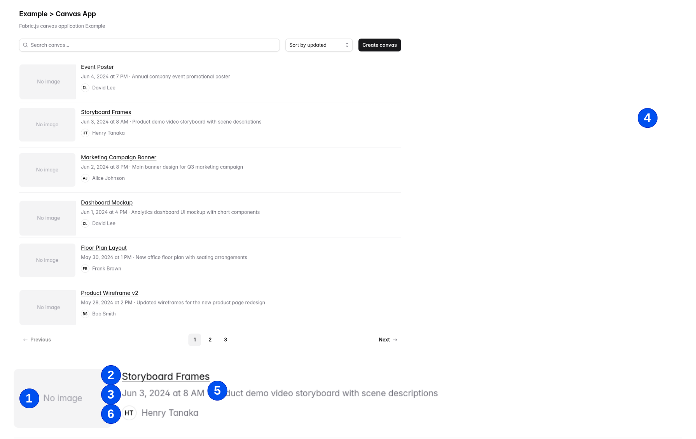

# Canvas List



- 仕様
    - １，mongoDBのcanvasesからデータをすべて表示します。updateAtの降順で表示させます。
    
  - ２．ページャーは今回削除してよいです。すべての件数を取得でよいです。スクロールバー表示


```
  canvasName: data.canvasName,
  canvasDescription: data.canvasDescription ?? null,
  thumbnailUrl: data.thumbnailUrl ?? null,
  canvas: data.canvas,
  backgroundImageUrl: data.backgroundImageUrl ?? null,
  updatedBy: data.updatedBy,
  updatedAt: new Date(), 
```

- １）thumbnailUrl　nullの場合は、publicフォルダのnoimage.pngを表示
- ２）canvasName : リンク(_id）
- ３）updateAt
- ４）ー
- ５）canvasDescription
- ６）updatedByのuser_idをkeyにuserのテーブルからAvater情報取得して表示　＋　user_idのscreen_name