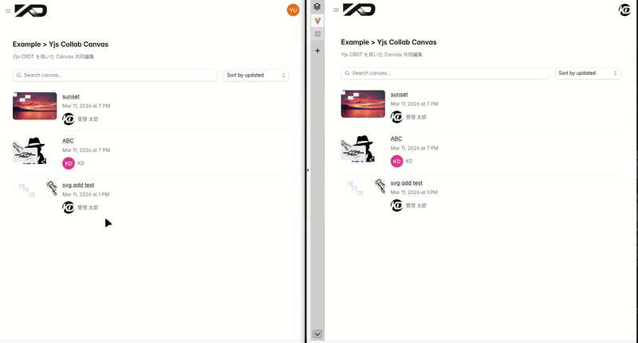

# 😎Introduction

> **「Fabric.js」YJS CRDTライブラリPOCアプリケーションです。**
>
> １．websockeServer内CRDT利用メモリのメトリクス検証。
>
> ２．高頻度同期変更処理 （マウス操作）によるServer負荷検証。
>
> ３．画像を含んだCanvasの同時編集及び同時複数Canvas編集負荷検証
>
> ４．Websocketでの水平スケール実現検討
>
> - ※「consistent hash」でのロードバランシング検証
>
> ３．CRDT Persistence方式検証
>
> 尚、YJS調査、実装方針は doc/yjs/配下を参照。awareness

---

## 🚀 環境

### [🐳Docker]

- composeは2種類
  - infraのみ実行　docker-compose.yml　：.env.local
  - apps/配下　　　docker-compose.app.yml : .env.docker

  ```shell
  //種類:infraのみ実行
  docker compose --env-file .env.local up -d
  //全てdocker起動
  docker compose -f docker-compose.yml -f docker-compose.app.yml --env-file .env.docker up --build -d
  ```

  | service         | 役割                        | 種類                 | compose            |
  | --------------- | --------------------------- | -------------------- | ------------------ |
  | mysql           | RDB（user管理）             | infra                | docker-compose     |
  | mongo           | Fablicjs-canvas persistence | infra                | docker-compose     |
  | MinIO           | S3互換Storage（画像系保存） | infra                | docker-compose     |
  | redis           | Que AutoSave                | infra                | docker-compose     |
  | client          | ReactWebapp                 | apps/client          | docker-compose.app |
  | server          | express                     | apps/server          | docker-compose.app |
  | yjs-server      | y-websocket                 | apps/yjs-server      | docker-compose.app |
  | yjs-scale-proxy | consistant hassing scaler   | apps/yjs-scale-proxy | docker-compose.app |

 - LOCAL-PORT設定(ローカルからアクセPORT)

    | service         | port                 |
    | --------------- | -------------------- |
    | mysql           | 3307                 |
    | mongo           | 27017                |
    | MinIO           | 9001                 |
    | redis           | 実装中！！           |
    | client          | 5317                 |
    | server          | 3000                 |
    | yjs-server      | 実装中!!             |
    | yjs-scale-proxy | ローカルからの利用無 |

---

### [重要] local-portバッティング時のport変更場所

#### 【👀全てDocker起動の場合】

| ImageName        | local  | docker |
| ---------------- | ------ | ------ |
| mysql            |        | ✅      |
| mongo            |        | ✅      |
| minIO            |        | ✅      |
| Redis            |        | ✅      |
| client (react)   |        | ✅      |
| server( express) |        | ✅      |
| yjs-websocket    | 作成中 | ✅      |
| yjs-scale-proxy  | 作成中 | ✅      |

`(applicationRoot)/.env.docker` 内の変更

```properties
# --- ローカルポート（ホスト公開用 / 競合時に変更可） ---
MYSQL_PORT=3307
MONGO_HOST_PORT=27017
MINIO_CONSOLE_PORT=9001
# --- Client ---
LOCALPOST=80
```

---

#### 【👀infraのみDockerでappはviteで実行（ pnpm run dev )】

| ImageName        | local  | docker |
| ---------------- | ------ | ------ |
| mysql            |        | ✅      |
| mongo            |        | ✅      |
| minIO            |        | ✅      |
| Redis            |        | ✅      |
| client (react)   | ✅      |        |
| server( express) | ✅      |        |
| yjs-websocket    | 作成中 |        |
| yjs-scale-proxy  | 作成中 |        |

`(applicationRoot)/.env.local` 内の変更

> 現在設定項目なし

server, yjs-server, client は以下変更が必要：

| 対象                   | 変更箇所                   | 設定方法                             |
| :--------------------- | :------------------------- | :----------------------------------- |
| client (Vite) :5173    | apps/client/vite.config.ts | server.port                          |
| server (Express) :3000 | apps/server/.env.local     | PORT=xxxx   （自分で作ってください） |
| proxy 先               | apps/client/vite.config.ts | proxy.target を server に合わせる    |

---

## 🚀️ Getting Started

### Prerequisites

- Node.js 22+
- pnpm 10.18+
- Docker / Docker Compose(Compose V2)

### DEV-TOOL

- 開発者用DEV-TOOLを提供しています。ローカルで動かす場合活用ください。
  - １）上記、Prerequisitesがインストールされている事。
  - ２）windowsはWSL2(linux環境)にて実行

 ```shell
 # ApplicationRootから
 pnpm cli
 ```


### ローカル開発（インフラだけ Docker、アプリはホスト実行）

```shell
# 1. 依存インストール
pnpm install

# 2. 全パッケージビルド
pnpm -r run build

# 3. インフラ起動 (MySQL, MongoDB, MinIO)
docker compose --env-file .env.local up -d

# 4. DBマイグレーション
pnpm --filter @kd1-labs/db-client run db:migrate

# 5. サーバー起動
pnpm --filter server dev

# 6. クライアント起動（別ターミナル）
pnpm --filter client dev
```

- [http://localhost:5173](http://localhost:5173) でアクセス
  - UserName: admin
  - Password: password

### フルDocker起動（全てコンテナで実行）

```shell
# 1. 依存インストール（マイグレーション実行用）
pnpm install

# 2. 全コンテナ起動（イメージのビルド含む）
docker compose -f docker-compose.yml -f docker-compose.app.yml \
  --env-file .env.docker up --build -d


pnpm install

#Docker停止

#1 mysql、mongo,minio 起動
docker compose -f docker-compose.yml --env-file .env.docker up -d --wait mysql mongodb minio

# minio(S3互換）初期Backet作成
docker compose -f docker-compose.yml --env-file .env.docker up minio-init

# Drizzle DBマイグレーション（Sheed） 実行（管理者ユーザ登録）
pnpm --filter @kd1-labs/db-client... run build
pnpm --filter @kd1-labs/db-client run db:migrate

# アプリケーションDeploy run
docker compose -f docker-compose.yml -f docker-compose.app.yml \
  --env-file .env.docker up --build -d


# 3. MySQL の healthcheck 通過を待つ
# mysqlが起動したら下記実行。

# 4. マイグレーション用にローカルビルド（db-client とその依存のみ）
pnpm --filter @kd1-labs/db-client... run build

# 5. DBマイグレーション（ホストから localhost:3307 経由で接続）
pnpm --filter @kd1-labs/db-client run db:migrate
```

- [http://localhost](http://localhost) でアクセス
  - UserName: admin
  - Password: password
- API: [http://localhost:3000](http://localhost:3000)

### フルDocker停止

```shell
docker compose -f docker-compose.yml -f docker-compose.app.yml down
```

### up --build で変更反映されない場合。

−compose up --buildでレイヤーキャッシュが聞いて変更が拾われない場合

```shell
docker compose -f docker-compose.yml -f docker-compose.app.yml build --no-cache client
```

---

## 🚀 Overview

1. Tech stack
2. Infra
3. package

  ```shell
    kd1-labs
      ├── apps            #アプリケーション
      │   ├── client           # front(react)
      │   └── server           # express(http)
      │   └── yjs-server       # yjs-websocketserver(websocket)
      │   └── yjs-scale-proxy  # yjs-scale-router(proxy)
      │   └── autoserve-proces # autosave processServer
      ├── packages        # 共通パッケージ
      │   ├── db-client        #drizzle orm(mysql)
      │   ├── db-schema        #drizzle schema(ddl,dml)
      │   ├── storage          #storege操作(S3互換用-MinIO)
      │   └── types　　         #共通型定義
      ├── docker-compose.yml
      ├── docker-compose.app.yml
      ├── Dockerfile.server           # server マルチステージビルド
      ├── Dockerfile.client           # client マルチステージビルド → nginx
      ├── docker/nginx/default.conf   # nginx 設定 (API プロキシ)
      ├── env.local    # infra：docer用envファイル
      ├── env.docker   # 全docer起動用envファイル
      ├── docker
      │   ├── mongodb
      │   ├── mysql
      │   ├── nginx
      │   │    ├── docker/nginx/default.conf   # nginx 設定 (API プロキシ)
      │   └── redis
      ├── package.json
      ├── pnpm-lock.yaml
      └── pnpm-workspace.yaml
  ```

---

## 🚀 Docker App Build (client / server)

### 設計方針

- `docker-compose.yml` (既存) はインフラのみ (MySQL, MongoDB, MinIO, Redis)
- `docker-compose.app.yml` (新規) にアプリ (client, server, yjs-server) を定義
- フルDocker起動時は両ファイルを指定して起動
- client は nginx で静的配信 + `/api` リバースプロキシ
- server は Node.js マルチステージビルド
- 環境切り替えは `.env.local` / `.env.docker` で行う

### ファイル構成

```shell
root/
├── docker-compose.yml          # 既存 (インフラ: MySQL, MongoDB, MinIO)
├── docker-compose.app.yml      # アプリ: client, server
├── .env.local                  # ローカル開発用 (host=localhost)
├── .env.docker                 # Docker用 (host=サービス名)
├── Dockerfile.server           # server マルチステージビルド
├── Dockerfile.client           # client マルチステージビルド → nginx
├── docker/nginx/default.conf   # nginx 設定 (API プロキシ)
```

### Docker ビルド方式

- **server**: `tsup` (esbuild) でバンドル + `pnpm deploy --prod` で依存を実体コピー (symlink 不要)
- **client**: `vite build` → nginx で静的配信 + `/api` リバースプロキシ

---

| コマンド                                 | 説明                                          |
| ---------------------------------------- | --------------------------------------------- |
| `pnpm test`                              | 全 workspace で vitest を watch 実行          |
| `pnpm test:run`                          | 全 workspace で 1 回だけテスト実行（CI 向け） |
| `pnpm --filter client test`              | client だけテスト                             |
| `pnpm --filter @kd1-labs/utils test:run` | utils だけ 1 回実行                           |

テストファイルは `src/**/*.test.{ts,tsx}` または `src/**/*.spec.{ts,tsx}` に置くと検知されます。まだテストがなくても `passWithNoTests: true` で `pnpm test:run` は成功します。

---

## 🚀メトリクス取得設計

| コンポーネント  | 役割                                                                                          |
| --------------- | --------------------------------------------------------------------------------------------- |
| cAdvisor        | Dockerコンテナの外側から、各コンテナのCPU・メモリ・ネットワーク利用率を自動収集します。       |
| Prometheus      | cAdvisorやアプリから送られるメトリクスを保存する時系列データベースです。                      |
| Grafana         | Prometheusのデータをグラフ化・可視化します。                                                  |
| App (WebSocket) | アプリ内部にライブラリ（prom-clientなど）を入れ、接続数などのカスタムメトリクスを公開します。 |

## その他

| ファイル                     | 内容                                          |
| ---------------------------- | --------------------------------------------- |
| `Dockerfile.server`          | server マルチステージビルド (**pnpm deploy**) |
| `Dockerfile.client`          | client マルチステージビルド (**nginx**)       |
| `docker-compose.app.yml`     | アプリサービス定義 (server, client)           |
| `docker/nginx/default.conf`  | nginx SPA配信 + API プロキシ                  |
| `.env.local`                 | ローカル開発用環境変数                        |
| `.env.docker`                | Docker用環境変数                              |
| `.npmrc`                     | `inject-workspace-packages=true`              |
| `apps/server/tsup.config.ts` | **tsup** ビルド設定                           |
| `docs/tips-tsup-esm.md`      | tsup/ESM の解説ドキュメント                   |
