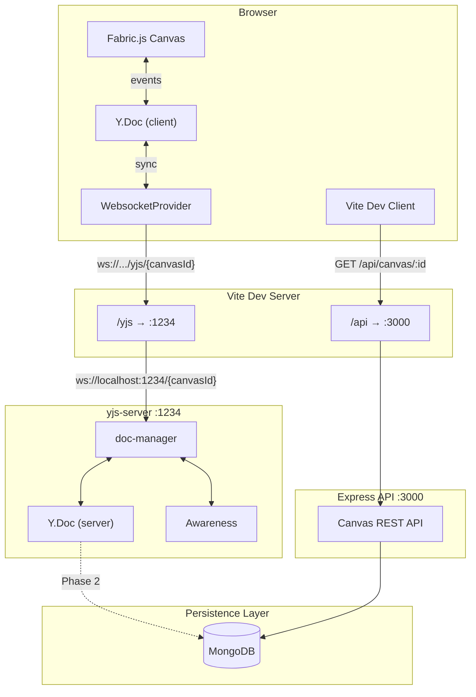

# Yjs CRDT による共同編集アーキテクチャ

## 概要

Yjs は CRDT (Conflict-free Replicated Data Type) ベースの共同編集フレームワークです。
本プロジェクトでは Fabric.js Canvas 上の図形操作をリアルタイムに同期します。

## アーキテクチャ

```
Client A (Fabric.js + Y.Map)
        ↕ WebSocket
    yjs-server (Y.Doc 管理)
        ↕ WebSocket
Client B (Fabric.js + Y.Map)
```

## データフロー

1. ユーザが Canvas 上で Circle を操作
2. `useYjsCircleSync` が変更を検知し Y.Map を更新
3. Yjs が差分を WebSocket 経由で他クライアントに送信
4. 受信側の `observe` コールバックが Fabric Canvas を更新

## 主要コンポーネント

| コンポーネント     | 役割                       |
| ------------------ | -------------------------- |
| `useYjsConnection` | WebSocket 接続・Y.Doc 管理 |
| `useYjsCircleSync` | Circle の双方向同期        |
| `yjs-server`       | Y.Doc のハブ・永続化       |

## スケーリング目標

- 100 Canvas × 10 ユーザ/Canvas
- サーバメトリクス取得による性能評価

## ああああ

